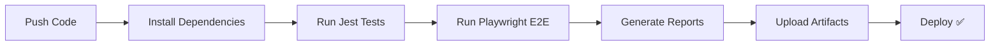

# 🦦 Platypus QA Lab

<div align="center">

**Test APIs. Get sarcastic feedback. Laugh together when things break.**

A full-featured API testing platform powered by Grok AI that makes quality assurance actually fun.

[Features](#-features) • [Quick Start](#-quick-start) • [Documentation](#-documentation) • [Tech Stack](#-tech-stack)

---

</div>

## 🎯 What is this?

I got tired of boring API testing tools, so I built this. **Platypus QA Lab** is a personal project that combines serious testing capabilities with AI-powered humor. 

Test any API, organize your tests into suites, set up automated monitoring, mock endpoints, collaborate with your team, and get witty commentary from Grok AI on every response. Because if your API is going to fail, at least the feedback should be entertaining.

## ✨ Features

<table>
<tr>
<td width="50%">

### 🎮 Core Testing
- **API Playground** - Test any endpoint instantly
- **Smart Analysis** - Grok AI reviews every response
- **Test Suites** - Organize multiple requests
- **Assertions** - Schema validation, regex, performance checks
- **Mock Server** - Simulate any API response

</td>
<td width="50%">

### 🤖 Automation
- **Scheduled Tests** - Cron-based test execution
- **Email Alerts** - Get notified when tests fail
- **Health Checks** - Monitor API uptime
- **CI/CD Ready** - GitHub Actions included
- **Auto Reports** - Generate test reports automatically

</td>
</tr>
<tr>
<td width="50%">

### 👥 Collaboration
- **Bug Tracker** - Report and track issues
- **Team Dashboard** - See what everyone is testing
- **Comments & Threads** - Discuss bugs together
- **Role System** - Tester, QA Lead, Admin roles
- **Activity Feed** - Real-time team updates

</td>
<td width="50%">

### 📊 Analytics
- **Visual Metrics** - Beautiful interactive charts
- **Trend Analysis** - Track quality over time
- **Export Reports** - PDF and CSV exports
- **API Docs Generator** - Auto-create OpenAPI specs
- **Performance Insights** - Response time tracking

</td>
</tr>
</table>

## 🚀 Quick Start

### Installation

```bash
# Clone the repo
git clone https://github.com/andresrodpaz/platypus-app.git
cd platypus-app

# Install dependencies
npm install

# Run it!
npm run dev
```

Open **http://localhost:3000** and start testing. That's it! 🎉

All data is stored locally in your browser - no database setup required.

### Optional: Full Setup with Database

Want persistence and team features? Add Supabase:

<details>
<summary>📝 Click to expand setup instructions</summary>

1. **Create `.env.local`:**

```env
NEXT_PUBLIC_SUPABASE_URL=your_supabase_project_url
NEXT_PUBLIC_SUPABASE_ANON_KEY=your_anon_key
SUPABASE_SERVICE_ROLE_KEY=your_service_role_key
RESEND_API_KEY=re_your_api_key  # Optional, for emails
```

2. **Run database migrations:**

Open your Supabase SQL Editor and run these scripts in order:
- `scripts/001_create_tables.sql`
- `scripts/create-test-auth-users.sql`

3. **Start the server:**

```bash
npm run dev
```

**Test Users** (all passwords: `TestPass123!`):
- `qa.lead@platypuslab.test` - QA Lead
- `senior.qa@platypuslab.test` - Senior QA
- `qa.engineer@platypuslab.test` - QA Engineer
- `junior.qa@platypuslab.test` - Junior QA
- `automation.qa@platypuslab.test` - Automation QA

</details>

## 🧪 Testing

```bash
# Unit & Integration tests
npm test

# Watch mode (for development)
npm run test:watch

# E2E tests (Playwright)
npm run test:ui

# E2E with browser UI
npm run test:ui:headed

# Run everything
npm test && npm run test:ui
```

## 🏗️ Tech Stack

<div align="center">

| Category | Technologies |
|----------|-------------|
| **Frontend** | Next.js 16 · TypeScript · Tailwind CSS v4 |
| **UI/UX** | shadcn/ui · Framer Motion · Recharts |
| **Backend** | Next.js API Routes · Supabase |
| **Database** | PostgreSQL (via Supabase) |
| **AI** | **Grok AI** for response analysis |
| **Email** | Resend |
| **Testing** | Jest · Playwright · Supertest |
| **CI/CD** | GitHub Actions |

</div>

## 🤖 AI-Powered Analysis

Every API response gets analyzed by **Grok AI**, which provides:

- 🎭 **Witty Commentary** - Context-aware humor about your API
- 📊 **Technical Insights** - Performance metrics and status analysis
- 🎯 **Smart Suggestions** - Tips for improving your APIs
- 😄 **Personality Modes** - Optimistic, sarcastic, or technical tones
- 🚨 **Issue Detection** - Spots problems before you do

Example response:

```json
{
  "comment": "This API is having a great day! Lightning fast response. 🚀",
  "emoji": "✨",
  "personality": "optimistic",
  "technicalNote": "Excellent response time under 200ms",
  "statusCode": 200,
  "responseTime": 150
}
```

## 🔄 CI/CD Pipeline

This project includes a complete GitHub Actions workflow that runs automatically on every push:



**What it does:**
- ✅ Runs all unit and integration tests
- ✅ Executes E2E tests with Playwright
- ✅ Generates coverage reports
- ✅ Uploads screenshots and videos on failure
- ✅ Creates test result artifacts
- ✅ Maintains code quality standards

See [`.github/workflows/test.yml`](.github/workflows/test.yml) for the full configuration.


## 📖 Documentation

Comprehensive guides in the `/docs` folder:

| Document | Description |
|----------|-------------|
| 📋 [QA Plan](docs/QA_PLAN.md) | Complete testing strategy |
| ✅ [Test Cases](docs/TEST_CASES.md) | 27+ detailed test scenarios |
| 🐛 [Bug Reports](docs/BUG_REPORTS.md) | Example bugs with humor |
| 📊 [Test Metrics](docs/TEST_METRICS.md) | Quality KPIs and tracking |
| 🎯 [Test Strategy](docs/TEST_STRATEGY.md) | Agile testing approach |
| 📡 [API Docs](docs/API_DOCUMENTATION.md) | Complete API reference |
| 📧 [Email Setup](docs/EMAIL_SETUP.md) | Notification configuration |
| 🇪🇸 [Guía en Español](docs/CONFIGURACION_ES.md) | Spanish guide |

## 🎯 Preset APIs

Test these APIs right out of the box:

```javascript
🐙 GitHub User API    → https://api.github.com/users/octocat
⚡ Pokemon API        → https://pokeapi.co/api/v2/pokemon/pikachu
🐕 Random Dog Images  → https://dog.ceo/api/breeds/image/random
🌌 NASA Picture       → https://api.nasa.gov/planetary/apod
📝 JSONPlaceholder    → https://jsonplaceholder.typicode.com/posts/1
```

## 👥 User Roles

<table>
<tr>
<td align="center" width="33%">

### 🧪 Tester
Test APIs<br>
Create suites<br>
Report bugs<br>
View team activity

</td>
<td align="center" width="33%">

### 👨‍💼 Lead QA
All Tester features<br>
Assign bugs<br>
Schedule tests<br>
Export team reports

</td>
<td align="center" width="33%">

### 👑 Admin
All Lead features<br>
Manage team<br>
Configure mocks<br>
Full system access

</td>
</tr>
</table>

## 🤝 Contributing

This is a personal project, but contributions are welcome!

1. 🍴 Fork the repo
2. 🌿 Create a feature branch: `git checkout -b feature/amazing-feature`
3. ✍️ Commit changes: `git commit -m 'Add amazing feature'`
4. 📤 Push to branch: `git push origin feature/amazing-feature`
5. 🎉 Open a Pull Request

**Guidelines:**
- Write tests for new features
- Maintain 80%+ code coverage
- Add humorous comments (platypus approved)
- Follow existing code style

## 📝 License

MIT License - do whatever you want with it.

## 🙏 Acknowledgments

Built with amazing open source tools:

- [Next.js](https://nextjs.org/) - The React framework
- [Supabase](https://supabase.com/) - Backend as a service
- [shadcn/ui](https://ui.shadcn.com/) - Beautiful components
- [Recharts](https://recharts.org/) - Data visualization
- [Playwright](https://playwright.dev/) - E2E testing
- [Jest](https://jestjs.io/) - Unit testing
- [Grok AI](https://grok.x.ai/) - AI-powered analysis
- [Resend](https://resend.com/) - Email notifications

And one very opinionated platypus 🦦 for quality assurance.

---

<div align="center">

**"Testing serious, results hilarious."**

Made with ☕ and 🦦 by [@andresrodpaz](https://github.com/andresrodpaz)

[⬆ Back to top](#-platypus-qa-lab)

</div>
